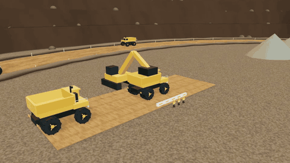
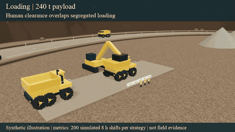
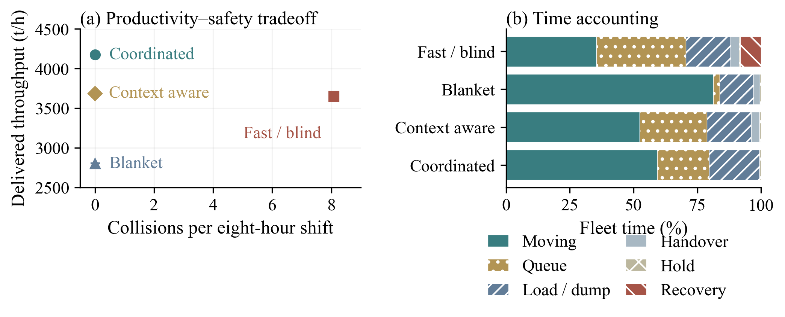

# SIEVE

**Staged Integration of Evidence across Verification Environments**

[](https://github.com/mansurarief/SIEVE/actions/workflows/ci.yml)
[](LICENSE)


A reproducible research simulator for autonomous open-pit haulage. SIEVE connects context-specific safety tests, controller revision, productivity experiments, 3D inspection, and versioned engineering evidence.

**Maintainer:** [mansurarief](https://github.com/mansurarief) · **[Paper / Overleaf sources](https://github.com/mansurarief/SIEVE-paper)** · **[Evidence protocol](docs/EVIDENCE_PROTOCOL.md)**

## See the haul cycle

Shovel loading → loaded haul → crusher discharge → empty return. Additional trucks, machinery, and segregated workers provide mine context.



**[Clean MP4](media/haulage-clean.mp4)** · **[Clean GIF](media/haulage-clean.gif)**



**[Annotated MP4](media/haulage-annotated.mp4)** · **[Annotated GIF](media/haulage-annotated.gif)** · **[Media provenance](media/README.md)**

These are synthetic illustrative montages, with compressed presentation time and cuts between workflow stages. They are not continuous trajectories from the fleet scheduler. Annotation values come from the numerical study; the clean video contains no labels or interface text. MP4s are silent 960 × 540, 20 fps; GIFs are 480 × 270 previews at twice the presentation speed.

## Run locally

Requires Node.js 24+ and Python 3.

```sh
git clone https://github.com/mansurarief/SIEVE.git
cd SIEVE
npm ci
npm start
```

Open **http://127.0.0.1:8766/simulator/**. Both repositories are private, so GitHub authentication is required to clone them.

Choose conditions, controller, model scope, and seed, then press **Restart**. Inspect **Overview**, **Follow**, **Driver**, **Left**, **Right**, **Plan**, **Field crew**, **Loading**, **Unloading**, **Passing**, and **Operations**. **Shift study** displays the stored 200-shift comparisons; **Save evidence** exports an encounter and trajectory. The driver view includes a dashboard.

The road is 32 m wide, with vehicle centres 8 m from its centreline. Opposing visual traffic uses separate lanes. Dust, extreme dust, wet braking, route closure, and human exclusion scenes expose different operating assumptions. `?paper&paused` enables large publication labels; `?clean&paused` hides the interface for scripted media capture.

## Reproduce the evidence

```sh
python3 -m venv .venv
source .venv/bin/activate
pip install -r requirements.txt
npm test
npm run experiment
```

This runs the analytical and conservation tests, regenerates numerical studies, and independently checks raw-record aggregation and evidence hashes. It needs no browser, GPU, TeX installation, or external dataset.

| Study | Reproducible scope |
|---|---|
| Initial stopping benchmark | 32,000 encounters: 4 conditions × 4 controllers × 2 model scopes × 1,000 seeds |
| Calibration example | 32 synthetic observations; six candidate speed caps, 250 training seeds per condition |
| Revised stopping validation | 4,000 independent-seed encounters |
| Announced hazard holds | 100 cases each for extreme dust, route closure, and crew exclusion |
| Haulage comparison | 200 eight-hour shifts per strategy, four strategies, six trucks |
| Handover sensitivity | 50 paired seeds at 0, 30, and 60 seconds |

## Reference results

Means over 200 synthetic eight-hour shifts per strategy; each delivered load is 240 t.

| Strategy | Throughput (t/h) | Cycle (min) | Moving speed (km/h) | Collisions / shift |
|---|---:|---:|---:|---:|
| Fast / condition-blind | 3,653 | 21.01 | 43.08 | 8.08 |
| Blanket restriction | 2,802 | 30.69 | 14.39 | 0 |
| Context aware | 3,685 | 23.16 | 29.37 | 0 |
| Human coordinated | 4,174 | 20.53 | 29.38 | 0 |



The initial guard still violates the 5 m requirement in 35 of 1,000 combined-condition encounters, including one collision. The revised envelope has zero observed violations in 4,000 validation encounters. These are outcomes under stated synthetic distributions, not measured mine accident rates, proof of zero risk, or a comparison with human drivers.

The shift model explicitly assumes loading and dumping service times, dispatch-order reservations, hazard exposure, recovery downtime, and human-clearance timing. Coordinating clearance with loading increases modeled throughput; setting the acknowledgment duration to zero removes that advantage. The final release record remains **BLOCKED** because physical confirmation and signed human review are absent.

## Figures, media, and the paper

`npm run reproduce` also regenerates the Times New Roman vector plots and framework figure. It requires XeLaTeX/BibTeX, the packages listed in [reproduction notes](docs/REPRODUCIBILITY.md), and Times New Roman. The paper is built separately.

With the local server running and Google Chrome and FFmpeg installed:

```sh
npm run screenshots
npm run media
```

The media script captures deterministic frames into ignored `.media-cache/`, encodes four compact clips, and records dimensions, duration, source hashes, and browser errors. `SIEVE_BASE_URL` can select another server when capturing media.

To update a sibling paper checkout after regenerating evidence:

```sh
python3 scripts/export_paper.py ../SIEVE-paper
cd ../SIEVE-paper
bash scripts/build.sh
```

The exporter copies only figure and numeric inputs, records the code commit and SHA-256 hashes, and leaves manuscript prose untouched.

## Repository map

- `simulator/`: shared longitudinal dynamics, finite-shift scheduler, tests, Three.js scene.
- `config/`, `data/`: selected policy caps and provenance-preserving calibration inputs.
- `scripts/`: experiments, independent checks, figure production, capture, encoding, and paper export.
- `results/`: raw outcomes, summaries, seed sets, representative replays, and assurance records.
- `figures/`: compact screenshots and vector publication figures; high-resolution captures can be regenerated.
- `media/`: small clean/annotated MP4 and GIF demonstrations with manifests.
- `docs/`: engineering evidence protocol and reproducibility details.

Built-in data and scenes are synthetic. Import future measured records with `node scripts/calibrate.mjs --input path/to/observations.csv`; see [data documentation](data/README.md). The default reproduction restores the built-in synthetic study. Physical measurements require their own provenance, uncertainty, and review; changing an input invalidates affected evidence.

## License and citation

Original code, documentation, generated data, and procedural media: **[MIT](LICENSE)**, copyright 2026 **mansurarief**. Dependencies retain their licenses; see [third-party notices](THIRD_PARTY_NOTICES.md). The manuscript has separate publication rights.

Use [CITATION.cff](CITATION.cff) to cite the software. The companion manuscript is a submission draft, not an accepted or published conference paper.

Presentation traffic uses lane-aware spacing, and capture checks conservative oriented truck and worker footprints on every frame with a 0.5 m margin per actor. An overlap stops capture. Opposing traffic advances in its direction of travel; the return truck is empty. This check prevents visual interpenetration in the demonstration and is separate from the paper’s stopping-safety evidence.

Wheels rotate from traveled distance using the rendered tire radius. Payload height increases during loading, is full before loaded haul begins, decreases during discharge, and is zero on the empty return lane. Capture verifies all six wheel angles and the loaded/empty states on every frame.
